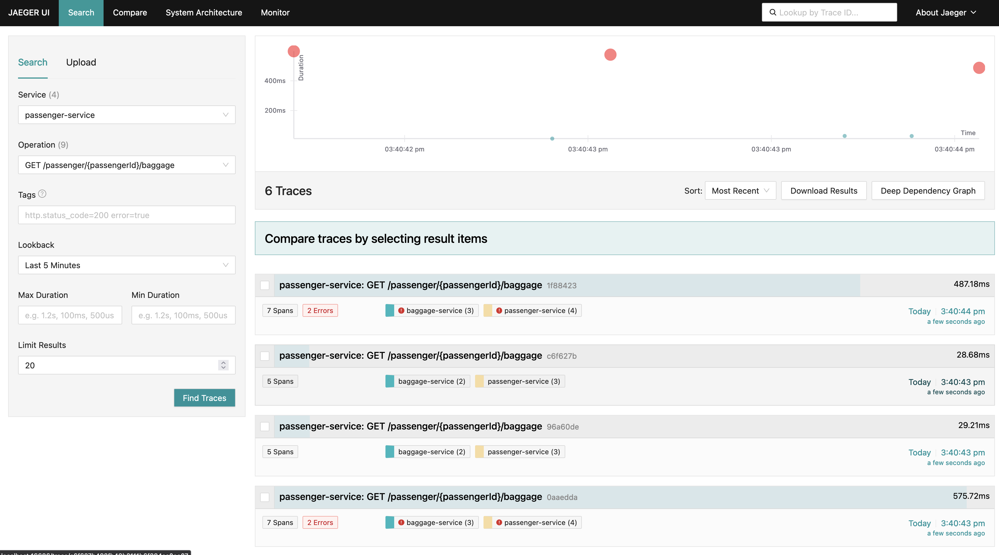
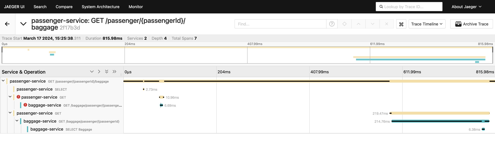

# 09 - Fault tolerance and tracing

## Fault tolerance

In distributed microservices systems, failures are inevitable. The network is unreliable, services can be slow, and the
system can be under heavy load. To build resilient systems, we need to handle these failures gracefully.

In this exercise, we will use the SmallRye Fault Tolerance library, which implements the MicroProfile Fault Tolerance
specification. This library provides a set of annotations to handle these challenges and build more resilient systems.

### SmallRye Fault Tolerance annotations

- `@Timeout` -- It defines a timeout for a method. If the method takes longer than the specified time,
  a `TimeoutException` is thrown. It's useful for preventing a method from executing too long and possibly giving users faster feedback.
- `@Retry` -- It specifies that a method should be executed again if it fails. You can specify the maximum number of
  retries and the delay between retries. It's useful for handling transient failures.
- `@CircuitBreaker` -- It specifies that a method should be executed in a circuit breaker. If the method fails, the
  circuit is opened, and the method is not executed for a specified time. After that time, the circuit is half-opened,
  and the method is executed again. If it fails, the circuit is opened again. If it succeeds, the circuit is closed
  again. It's useful for not overloading a failing service.
- `@Fallback` -- It specifies a fallback method that should be executed if the original method fails. It's useful for
  providing a default value (e.g. default recommendations) or a default behavior when a method fails.

#### Example

```java
public class HelloResource {

    @GET
    @Path("/hello")
    @Timeout(1000)
    public String hello() {
        // calling an external service for e.g. name
    }

    @GET
    @Path("/hello")
    @Retry(maxRetries = 3, delay = 1000)
    public String hello() {
        // calling an external service for e.g. name
    }

    @GET
    @Path("/hello")
    @CircuitBreaker(
            requestVolumeThreshold = 4, // number of requests before the circuit is opened 
            failureRatio = 0.75,  // the failure ratio at which the circuit should open
            delay = 1000,  // the time the circuit should be opened before it's half-opened
            successThreshold = 2  // the number of successful requests before the circuit is closed again
    )
    public String hello() {
        // calling an external service for e.g. name
    }

    @GET
    @Path("/hello")
    @Fallback(fallbackMethod = "fallbackHello")
    public String hello() {
        // calling an external service for e.g. name
    }

    public String fallbackHello() {
        return "Hello, fallback!";
    }
}
```

## Tracing

In modern cloud-based applications, it is important to have visibility into the system. Tracing is a technique to follow the flow of the code and understand how the different services interact with each other. It is useful for debugging, performance analysis, and understanding the system.

### OpenTelemetry

OpenTelemetry is a set of APIs, libraries, agents, and instrumentation to provide observability for cloud-native software. It provides a set of tools to generate, collect, and export telemetry data (traces) for analysis.

### Jaeger

Jaeger is an open-source, end-to-end distributed tracing system. It is used to monitor and troubleshoot microservices-based distributed systems. It is used to monitor and troubleshoot distributed systems.

It collects data from the services using OpenTelemetry over gRPC, stores them, and visualizes the traces in a user-friendly way.

It supports:
- Collecting traces from the services
- Storing the traces
- Visualizing the traces
- Querying the traces



## State of the project

- In `baggage-service,` there is an artificial failure in the `BaggageResource.getBaggageByPassengerId` method.
- Smallrye fault tolerance is added to all services.
- Opentelemetry extension is added to the `flight-service` and `baggage-service`.

## Tasks

### 1. Add fault tolerance to the `passenger-service`

#### 1.1. In `passenger-service`, go to `PassengerResource` and follow the TODOs

Add a `@Timeout` annotation to the `get` method. Set the value to 250 milliseconds.

#### 1.2. In `passenger-service`, add `@Retry` annotation to the `getPassengerWithBaggage` in `PassengerService`.

Baggage service has 50 % of failure to retrieve baggage by passenger id.

1. Create a passenger and baggage for the passenger.
2. Try to retrieve the passenger with baggage using `/passenger/{passengerId}/baggage` endpoint.
    1. It should fail 50 % of the time.
3. Add a `@Retry` annotation to the `getPassengerWithBaggage` method in `PassengerService`. Set the maximum number of retries to 4 and the delay between retries to 500 ms.
4. Try again to retrieve the passenger with baggage using `/passenger/{passengerId}/baggage` endpoint.
    1. It should almost always succeed. Note the delay in the response, which means the baggage service failed, and the retry was executed.

### 2. Add fault tolerance to the `flight-service`

#### 2.1. In `flight-service`, go to `FlightService` and follow the TODOs

Add a `@CircuitBreaker` annotation to the `cancelFlight` method.

### 3. Add OpenTelemetry config

#### 3.1. Add extension opentelemetry to the `passenger-service`

Go to `./passenger-service` and run:

```bash
quarkus extension add opentelemetry
```

#### 3.2. Configure Jaeger in docker-compose

Add Jaeger service to the `docker-compose.yml` file.

```yaml
  jaeger-all-in-one:
    image: jaegertracing/all-in-one:latest
    ports:
      - "16686:16686" # Jaeger UI
      - "4317:4317"   # OTLP gRPC receiver
    environment:
      - COLLECTOR_OTLP_ENABLED=true
    networks:
      - app-network
```

#### 3.3. Set `QUARKUS_OTEL_ENDPOINT` for the `passenger-service`

In `docker-compose.yaml` set `QUARKUS_OTEL_ENDPOINT` environment variable to mark Jaeger as the endpoint for the `passenger-service`.

### 4. Jaeger UI

#### 4.1. Simulate some traffic

1. Start the services using `docker compose`. (see hints)
2. Create a passenger and baggage for the passenger.
3. Try to retrieve the passenger with baggage using `/passenger/{passengerId}/baggage` endpoint more than once.

#### 4.2. Open Jaeger UI

1. Go to `http://localhost:16686` and check if the traces are visible.
2. Check the traces for the `passenger-service` and `POST /passenger/{passengerId}/baggage` operation.
3. You should be able to see the traces with retries in both passenger and baggage services, similar to the image below.

   

4. Open one of the traces

   

### 5. Submit the solution

1. Finish the tasks
2. Push the changes to the main branch
3. GitHub Classroom automatically prepared a feedback pull request for you
4. Go to the repository on GitHub and find the feedback pull request
5. Set label to "Submitted"
6. GitHub Actions will run basic checks for your submission
7. Teacher will evaluate the submission as well and give you feedback

## Hints

- Build and run docker
  ```bash
  cd passenger-service && mvn clean install && cd ../baggage-service && mvn clean install && cd ../flight-service && mvn clean install && cd .. && docker compose up --build
  ```

## Troubleshooting

- Check if your docker engine is running.

## Further reading

- https://quarkus.io/guides/smallrye-fault-tolerance#adding-resiliency-retries
- https://quarkus.io/guides/opentelemetry